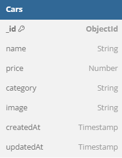

# Challenge 4

## Database



## Inisialisasi Project

1. Clone repository

```
git clone https://github.com/rianwp/binar-fsw-CH4-challenge.git
```

2. Install dependency

```
npm install
```

3. Buat file `.env` dan copy env variable dari file `.env.example`

4. Menjalankan server

```
npm run dev
```

5. Mengakses sesuai PORT yang ditentukan, defaultnya `localhost:3000`

## Routes

| Route                     | Method | Description                                                        |
| ------------------------- | ------ | ------------------------------------------------------------------ |
| `/`                       | `GET`  | Page untuk menampilkan list cars                                   |
| `/create`                 | `GET`  | Page untuk menambahkan data car                                    |
| `/edit/:id`               | `GET`  | Page untuk mengedit data car dengan id tertentu                    |
| `/cars/action/create`     | `POST` | Endpoint untuk melakukan action create data car                    |
| `/cars/action/delete/:id` | `POST` | Endpoint untuk melakukan action delete data car dengan id tertentu |
| `/cars/action/edit/:id`   | `POST` | Endpoint untuk melakukan action edit data car dengan id tertentu   |
